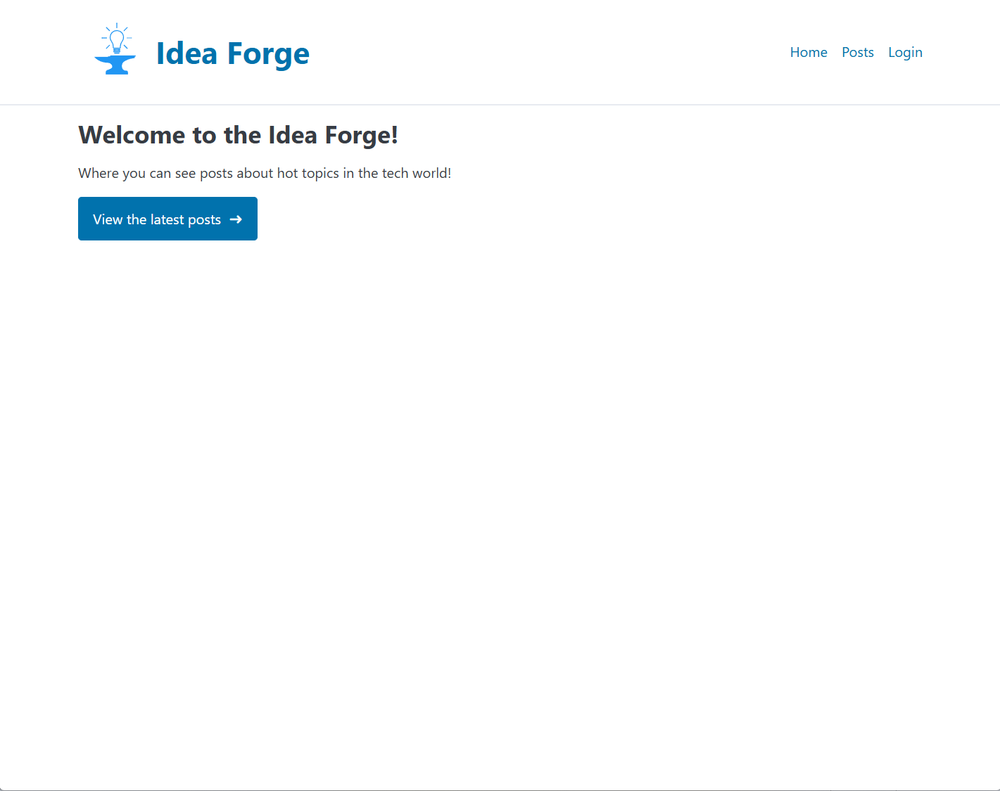
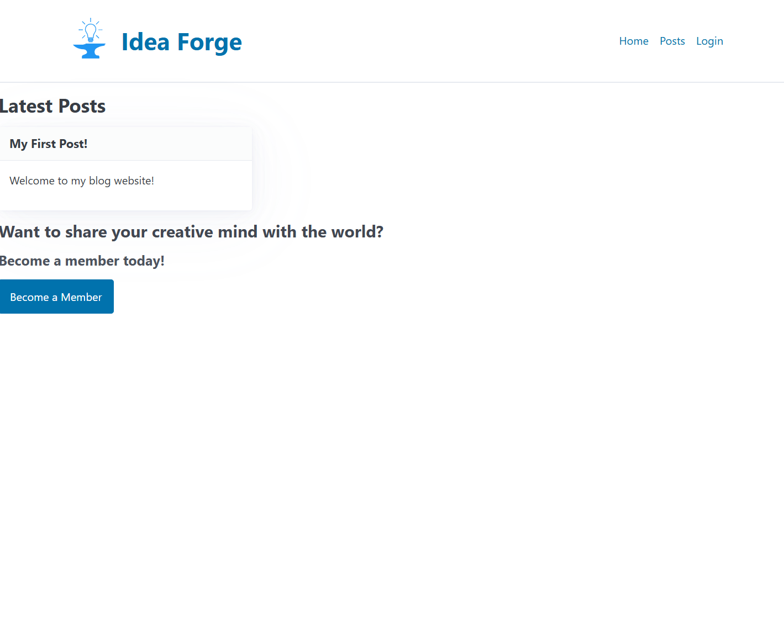
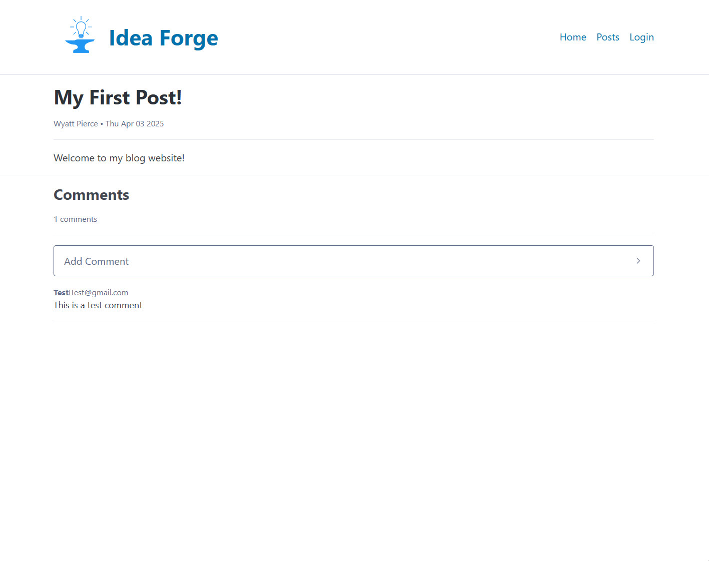

# Blog Frontend

This repository contains the frontend application for the Blog project, allowing users to read blog posts and submit comments.

- Live Link → [Here](https://94070bcf.blog-home-4o8.pages.dev/)

---

## Features

- **Responsive Design**: Ensures optimal viewing experience across devices.
- **Post Listing**: View all published blog posts.
- **Post Details**: Read full blog posts and view associated comments.
- **Comment Submission**: Users can submit comments on posts without requiring an account.

---

## Technologies Used

- **React.js**: JavaScript library for building user interfaces.
- **React Router**: For handling in-app routing.
- **JWT**: For secure admin authentication.
- **PicoCSS**: Lightweight CSS Library for styling.
- **react-markdown**: JS Library to parse Markdown content.

---

## Installation

### 1. Clone the repository:

```bash
git clone https://github.com/wpierce19/Blog-Front.git
cd Blog-Front
```

### 2. Install Dependencies:

```bash
npm install
```

### 3. Set up environmental variables:

```bash
VITE_BEARER_TOKEN = 
```
You can obtain the bearer token from your profile page on the Idea Forge Dashboard

## Screenshots






